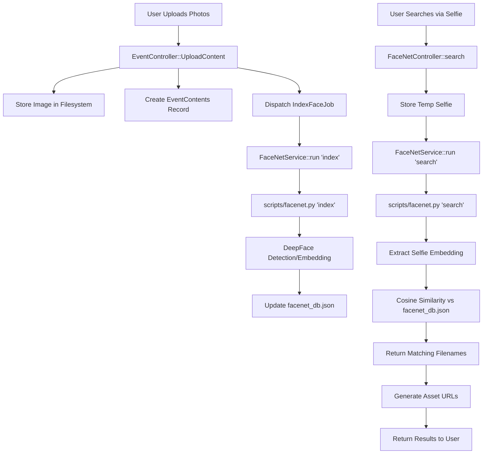

# Face Detection & Image Processing Documentation

This document explains the architecture, logic, and file interactions for the AI-powered face detection and searching system in the Apres Pics application.

## 1. System Architecture

The system uses a hybrid approach:
- **Backend (Laravel/PHP)**: Manages file storage, database records (excluding embeddings), API endpoints, and background job scheduling.
- **AI Engine (Python)**: Handles the heavy lifting of face detection and face recognition (embedding generation and matching).

### Workflow Diagram



---

## 2. File Responsibilities

| File | Responsibility |
| :--- | :--- |
| **[scripts/facenet.py](file:///c:/Projects/Laravel/apres_pics/scripts/facenet.py)** | The "Brain". Uses `DeepFace` to detect faces and generate 512-dimensional embeddings. Performs cosine similarity for searching. |
| **[app/Services/FaceNetService.php](file:///c:/Projects/Laravel/apres_pics/app/Services/FaceNetService.php)** | The "Bridge". Executes the Python script via shell commands and parses the JSON output. |
| **[app/Jobs/IndexFaceJob.php](file:///c:/Projects/Laravel/apres_pics/app/Jobs/IndexFaceJob.php)** | The "Worker". Handles background indexing of images to ensure the API remains responsive during uploads. |
| **[app/Http/Controllers/Api/FaceNetController.php](file:///c:/Projects/Laravel/apres_pics/app/Http/Controllers/Api/FaceNetController.php)** | The "Search API". Handles selfie uploads, triggers the search service, and formats results. |
| **[app/Http/Controllers/Api/EventController.php](file:///c:/Projects/Laravel/apres_pics/app/Http/Controllers/Api/EventController.php)** | The "Upload API". Dispatches indexing jobs when new event content is added. |

---

## 3. Storage Mechanism

### JSON Database
Unlike traditional relational databases, face embeddings are stored in flat JSON files for performance and isolation:
- **Location**: `storage/app/public/events/{event_id}/facenet_db.json`
- **Format**: A list of objects containing the filename and its face embedding vector.
  ```json
  [
    {
      "filename": "1711785600_party.jpg",
      "embedding": [0.123, -0.456, ... (512 values)]
    }
  ]
  ```

### Why JSON?
1. **Event Isolation**: Each event has its own database file. This prevents "cross-talk" between different events.
2. **Search Speed**: Loading a single file and iterating over local vectors is extremely fast for events with hundreds of photos.
3. **Portability**: The DB file stays with the event's images.

---

## 4. AI Logic (DeepFace/FaceNet512)

### Face Detection
We use a multi-tiered detector strategy in `facenet.py` to ensure we don't miss any faces:
1. **RetinaFace**: The primary detector. Highly accurate, even with tilted or partially covered faces.
2. **MTCNN/SSD/OpenCV**: Fallback detectors if RetinaFace fails.
3. **Skip**: If still no face is found, we might try to process the image as-is (assuming it's a tight crop).

### Face Recognition
- **Model**: `Facenet512` (Google's FaceNet architecture with a 512-dimensional output).
- **Metric**: **Cosine Distance**.
- **Threshold**: `0.5`. 
  - Lower than 0.5 is stricter (matches fewer photos, but higher confidence).
  - Higher than 0.5 is looser (higher chance of identifying you in blurry photos, but risk of false positives).

---

## 5. Key Interactions

### The Indexing Process
1. `EventController` receives images and dispatches `IndexFaceJob`.
2. `IndexFaceJob` ensures the file is in the correct event folder.
3. `FaceNetService` runs `python facenet.py index [dbPath] [imgPath]`.
4. Python script extracts embeddings and **appends** them to `facenet_db.json`.

### The Searching Process
1. `FaceNetController` receives a selfie.
2. Selfie is saved to `storage/app/public/temp/`.
3. `FaceNetService` runs `python facenet.py search [dbPath] [selfiePath]`.
4. Python script:
   - Loads the event's `facenet_db.json`.
   - Generates an embedding for the selfie.
   - Compares the selfie embedding against every embedding in the JSON list.
   - Returns a list of filenames where distance < 0.5.
5. Laravel generates public URLs for these filenames and returns them.
6. Temporary selfie is deleted.

---

> [!IMPORTANT]
> **Performance Note**: Face detection is CPU-intensive. Indexing is performed in the background (via Queue) to prevent API timeouts. Searching is performed synchronously, typically taking 2-5 seconds depending on server hardware.

> [!TIP]
> To improve accuracy, users should upload clear, front-facing selfies without heavy sunglasses or face masks.
